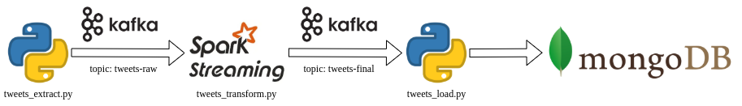
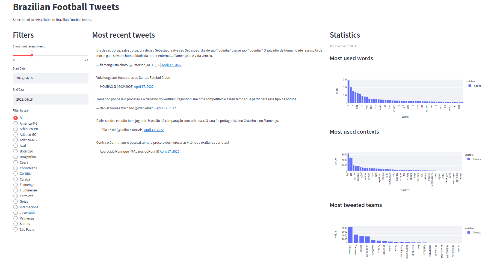

# Brazilian Football Tweets

   

A stream processing project designed to analyze tweets related to brazilian football teams as they are published, identifying the team being mentioned, such as the context applied and the most used words by the users overall or filtered by team.

The application consumes tweets from the official [Twitter API](https://developer.twitter.com/en/docs), a very broad interface for consuming tweets, user profiles, posting and many other use cases.

Although the project is meant to be simple, objective and locally deployed, the technologies applied were picked considering scalability, allowing deployment on a much bigger scale. Thus, this structure could be adapted and applied, for example, on cloud providers with a larger and managed infrastructure.



The tweets are first sent to a Kafka topic consumed by a Spark Streaming application. Into the Spark job, the tweets are processed to classify key information and then sent back to another Kafka topic. Finally, the processed tweets are inserted into a collection on a MongoDB instance, ready to be consumed by a simple user interface built with Streamlit, displaying the most recent tweets and relevant statistics, provinding insights on what the users are talking about when it comes to each football team. 


## Setup

### Configuration

There is a `docker-compose.yml` file containing all the services needed for the project to work.

A Twitter Developer account will be needed. One could apply for the account following this [instructions](https://developer.twitter.com/en/docs/twitter-api/getting-started/getting-access-to-the-twitter-api).

Once the account is available, a `.env` file is expected on the root directory to define the Twitter Bearer Token as a secret. Thus, the `.env` file will follow the structure:

```
TWITTER_BEARER_TOKEN={YOUR_TOKEN}
```

There are other configurations made with environment variables directly on the docker-compose, which can be adjusted anytime, such as:

* `REMOVE_RETWEETS`: remove retweets from the search results
* `MAX_RESULTS`: maximum number of results per request (must be between 10 and 100)
* `TWEET_LANG`: language of the result tweets
* `SLEEP_TIME`: sleep time between requests (must be greater than 5 seconds, so it will respect Twitter's rate limits)

### Running

1) After the configuration, all it takes to deploy the application is running:

```bash
docker-compose up
```

At the first execution it will be needed to build the custom Docker image used and to download the needed Spark package, so it may take a longer time to start.

2) After starting up, the topics need to be created once. In order to do so, connect to the kafka container:

```bash
docker exec -it kafka bash
```

And execute the commands to create the two topics needed:

```bash
kafka-topics.sh --create --topic tweets-raw --bootstrap-server kafka:9092 --partitions 3
kafka-topics.sh --create --topic tweets-final --bootstrap-server kafka:9092 --partitions 3
```

An arbitrary number of partitions may be used (even none).

3) (Optional) MongoDB indices may be created to improve its searching performance through the collection. Connect to the mongo container:

```bash
docker exec -it mongo bash
```

Connect to the MongoDB instance and to the `tweets` database:

```bash
mongo
use tweets
```

Then create the indices on the `tweets` collection, using fields `created_at` and `team`:

```bash
db.tweets.createIndex({"created_at": -1})
db.tweets.createIndex({"team": 1})
```

## Usage

The user interface may be accessed on `http://localhost:8501/`, showing the most recent tweets, filters to apply and statistics on top of the retrieved tweets, such as the most used words, most used contexts and the most popular teams on twitter.



The MongoDB instance is also available from outside the docker containers on `http://localhost:27017/`, so it is possible to consult the documents directly from the collection on the database.

The main inputs the application need to work properly are located on the `input` directory, on json format:

* `input/teams.json`: a list of all the teams being searched on tweets. Each team is an object including the fields:
  * `tag`: a unique identifier
  * `name`: an exhibition name
  * `synonyms`: a list of identifiers for the team
* `input/contexts.json`: a list of football context words (e.g.: goal, score, match) 

That being so, the inputs could be modified to apply the project strucuture on any set of teams and context words.
